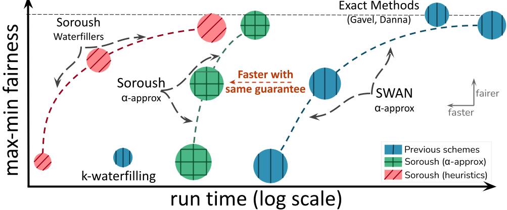

# Solving Max-Min Fair Resource Allocations Quickly on Large Graphs

`Soroush` is a general and scalable max-min fair allocator. It consists of a group of approximate and heuristic methods that (a) solve at most one optimization, and (b) enable users to control the trade-offs between efficiency, fairness, and speed. For more information, see our NSDI24 paper ([Solving Max-Min Fair Resource Allocations Quickly on Large Graphs](https://www.usenix.org/conference/nsdi24/presentation/namyar-solving)).

<p align="center">

</p>


## Code Structure
```
├── cluster_scheduling      # Scripts and implementation for the CS usercase.
|           |       
|           ├── alg         # implementation of all the allocators in Soroush.
|           |
|           ├── scripts     # code for generating different problem instances and benchmarking different allocators.
|           |
|           └── utilities   # common utility functions for cluster scheduling. 
|
|
└── traffic_engineering     # Scripts and implementations for the TE usecase.
            |
            ├── alg         # implementation of all the allocators in Soroush.
            |
            ├── benchmarks  # code for benchmarking different allocators.
            |
            ├── scripts     # code for parsing the log files and drawing plots.
            |
            └── utilities   # common utilitiy functions for traffic engineering.
```

### Installation
Soroush is implemented in Python. We tested this repo on Ubuntu 18.04 and Python 3.8.13.


* Install the necessary requirements.

```bash
pip install -r requirements.txt
```

* Install Gurobi. Our experiments are on Gurobi v10.0.

```bash
conda install gurobi=10.0
```
You also need a license for Gurobi. If you are in academia, you can follow the instructions on Gurobi's website to obtain a license.

* Please refer to the README under `cluster_scheduling` and `traffic_engineering` for problem specific installation guidelines.

## Citation
```bibtex
@inproceedings{soroush,
  author = {Namyar, Pooria and Arzani, Behnaz and Kandula, Srikanth and Segarra, Santiago and Crankshaw, Daniel and Krishnaswamy, Umesh and Govindan, Ramesh and Raj, Himanshu},
  title = {{S}olving {M}ax-{M}in {F}air {R}esource {A}llocations
  		  {Q}uickly on {L}arge {G}raphs},
  booktitle = {21st USENIX Symposium on Networked Systems Design and
  		  Implementation (NSDI 24)},
  year = {2024},
}
```

## Contributing

This project welcomes contributions and suggestions.  Most contributions require you to agree to a
Contributor License Agreement (CLA) declaring that you have the right to, and actually do, grant us
the rights to use your contribution. For details, visit https://cla.opensource.microsoft.com.

When you submit a pull request, a CLA bot will automatically determine whether you need to provide
a CLA and decorate the PR appropriately (e.g., status check, comment). Simply follow the instructions
provided by the bot. You will only need to do this once across all repos using our CLA.

This project has adopted the [Microsoft Open Source Code of Conduct](https://opensource.microsoft.com/codeofconduct/).
For more information see the [Code of Conduct FAQ](https://opensource.microsoft.com/codeofconduct/faq/) or
contact [opencode@microsoft.com](mailto:opencode@microsoft.com) with any additional questions or comments.

## Trademarks

This project may contain trademarks or logos for projects, products, or services. Authorized use of Microsoft 
trademarks or logos is subject to and must follow 
[Microsoft's Trademark & Brand Guidelines](https://www.microsoft.com/en-us/legal/intellectualproperty/trademarks/usage/general).
Use of Microsoft trademarks or logos in modified versions of this project must not cause confusion or imply Microsoft sponsorship.
Any use of third-party trademarks or logos are subject to those third-party's policies.